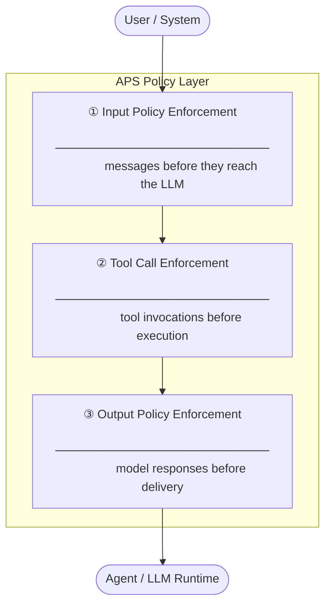

  <picture>
    <source media="(prefers-color-scheme: dark)" srcset="aps-readme-dark.svg">
    <source media="(prefers-color-scheme: light)" srcset="aps-readme-light.svg">
    
  </picture>

# Agent Policy Specification (APS)

**A vendor-neutral specification for enforcing policies on AI agent interactions.**

APS defines a standard interception layer that sits between an agent and its underlying LLM. It gives operators, developers, and platform teams a consistent way to express, evaluate, and enforce policies on every message, tool call, and model response, before any side effect occurs.

---

## The Problem

AI agents act on behalf of users and systems. They call tools, read data, and produce outputs, often with little or no enforcement boundary between an instruction and its consequences.

Current approaches to safety and control are fragmented: guardrails are baked into individual agent frameworks, applied inconsistently across environments, and difficult to audit or reason about independently from application logic.

---

## What APS Defines

APS specifies three interception points in the agent–LLM interaction lifecycle:

For each interception point, APS defines:

- **A data model** — the schema of what is evaluated (messages, tool call descriptors, output payloads)
- **A policy interface** — how policies are declared, composed, and resolved
- **An enforcement contract** — what actions a compliant runtime must take on a policy decision (`allow`, `deny`, `redact`, `transform`, `audit`)

---

## Policy Authoring

APS is designed to be extensible. The specification defines the interception contract — not the policy language. Any engine that can receive a context and return a decision can implement an APS policy. Current authoring models include:

| Model | Description |
|---|---|
| **Rego (WASM)** | Declarative OPA policies compiled to WebAssembly and evaluated in-process |
| **OPA (REST)** | Policies evaluated by a running OPA server via its HTTP API |
| **Runtime** | Typed interfaces in TypeScript or Java for policies requiring imperative logic or external I/O |
| **DSL** | Custom domain-specific languages — bring your own policy syntax, backed by any evaluator |

New authoring models can be added without changes to the core specification.

---

## Status

APS is in the **concept and specification design** phase.

| Artifact | Status |
|---|---|
| Core specification | In progress |
| Reference implementation (Java) | Planned |
| Reference implementation (TypeScript) | Planned |
| Conformance test suite | Planned |

---

## Get Involved

This specification is developed openly. Contributions, feedback, and discussion are welcome.

- Read the spec drafts in the [`spec`](https://github.com/agentpolicyspecification/spec) repository
- Open an issue to propose a policy model, discuss an interception contract, or raise a use case
- Join the conversation in [Discussions](https://github.com/orgs/agentpolicyspecification/discussions)

---

*APS is vendor-neutral and not tied to any specific agent framework, LLM provider, or cloud platform.*
